    

  <h1 class="text-6xl font-bold tracking-tight text-white">Introduction to Cursor</h1>
  <h2 class="text-3xl text-[#6E6E6E]">October 24, 2025</h2>
  
DAL Health Datathon

---
layout: section
class: text-center
background: '#171717'
transition: slide-up
---

# Who Am I?

👨‍💻

Let me introduce myself

---
layout: center
class: px-8
transition: slide-up
---

  

  

  

    

  

  

    
  

  
  

      <h2 class="text-lg text-white font-semibold">Mazen Alotaibi</h2>
      
AI Staff Engineer at <a href="https://deep.sa" class="text-white">deep.sa</a> (Leading Lab42)

      
Senior ML Engineer at <a href="https://maala.tech" class="text-white">Malaa Technologies</a>

      
MSc AI and BSc CS from <a href="https://oregonstate.edu" class="text-white">Oregon State University</a>

      
2023 PyTorch Ambassador Award & Cursor Ambassador

      
Accelerating technology and AI development in 🇸🇦

      
<a href="https://ma7.dev" class="text-white">ma7.dev</a> | <a href="https://x.com/ma7dev" class="text-white">@ma7dev</a>

  

---
layout: center
class: text-center
---

# Agenda

  
  
    

      

        🤖
        

          <h3 class="font-semibold text-base mb-0.5">Introduction to AI Tools</h3>
          
The AI landscape and where Cursor fits

        

      

    

    

      

        ⚡
        

          <h3 class="font-semibold text-base mb-0.5">Introduction to Cursor</h3>
          
Deep dive into features and capabilities

        

      

    

    

      

        🌟
        

          <h3 class="font-semibold text-base text-green-400 mb-0.5">Using Cursor for Everything</h3>
          
Beyond coding - writing, planning, and more

        

      

    

  

---
layout: section
class: text-center
background: '#171717'
transition: slide-up
---

# Introduction to AI Tools

🤖

Understanding the AI landscape before diving into Cursor

---
layout: center
class: px-8
---

# The AI Revolution in 2025

  

    <h3 class="text-xl font-bold mb-4">🌊 AI Everywhere</h3>
    <ul class="text-sm text-[#6E6E6E] space-y-2">
      <li>AI tools have transformed how we work</li>
      <li>From writing to coding to design</li>
      <li>Making experts 10x more productive</li>
      <li>Making beginners competitive</li>
    </ul>
  

  
  

    <h3 class="text-xl font-bold mb-4">💡 Why AI Tools Matter</h3>
    <ul class="text-sm text-[#6E6E6E] space-y-2">
      <li>Automate repetitive tasks</li>
      <li>Learn as you work</li>
      <li>Reduce errors and bugs</li>
      <li>Ship faster and iterate more</li>
    </ul>
  

---
layout: center
class: px-8
---

# AI Tools Landscape

  

    <h3 class="text-lg font-bold mb-3">✍️ Writing & Chat</h3>
    <ul class="text-sm text-[#6E6E6E] space-y-1">
      <li>ChatGPT (321M+ users)</li>
      <li>Claude (Anthropic)</li>
      <li>Gemini (Google)</li>
      <li>Perplexity AI</li>
    </ul>
  

  
  

    <h3 class="text-lg font-bold mb-3">🎨 Design & Images</h3>
    <ul class="text-sm text-[#6E6E6E] space-y-1">
      <li>Midjourney</li>
      <li>DALL-E 3</li>
      <li>Canva AI (220M+ users)</li>
      <li>Leonardo AI</li>
    </ul>
  

  
  

    <h3 class="text-lg font-bold mb-3">💻 Coding</h3>
    <ul class="text-sm text-[#6E6E6E] space-y-1">
      <li>Cursor</li>
      <li>GitHub Copilot (1M+ paid)</li>
      <li>Windsurf</li>
      <li>Cline (Open Source)</li>
    </ul>
  

  
  

    <h3 class="text-lg font-bold mb-3">🎥 Video & Audio</h3>
    <ul class="text-sm text-[#6E6E6E] space-y-1">
      <li>Runway ML</li>
      <li>Google Veo 3</li>
      <li>Synthesia</li>
      <li>Suno (Music)</li>
    </ul>
  

  
  

    <h3 class="text-lg font-bold mb-3">📊 Content Creation</h3>
    <ul class="text-sm text-[#6E6E6E] space-y-1">
      <li>Jasper AI</li>
      <li>Copy.ai</li>
      <li>Writesonic</li>
      <li>Notion AI</li>
    </ul>
  

  
  

    <h3 class="text-lg font-bold mb-3">🔧 Automation</h3>
    <ul class="text-sm text-[#6E6E6E] space-y-1">
      <li>Zapier AI</li>
      <li>n8n</li>
      <li>Microsoft Copilot</li>
      <li>Replit Ghostwriter</li>
    </ul>
  

---
layout: center
class: px-8
---

# AI Coding Tools: The Landscape

  

    

      🔧
      

        <h3 class="text-lg font-bold">GitHub Copilot</h3>
        
Multi-IDE integration

      

    

    

      <ul class="text-xs text-[#6E6E6E] space-y-1 ml-3">
        <li>Works in VS Code, JetBrains, Neovim</li>
        <li>Battle-tested: 1M+ Fortune 100 users</li>
        <li>Seamless GitHub workflow integration</li>
      </ul>
    

  

  
  

    

      🌊
      

        <h3 class="text-lg font-bold">Windsurf</h3>
        
Agentic-first approach

      

    

    

      <ul class="text-xs text-[#6E6E6E] space-y-1 ml-3">
        <li>Powerful autonomous task execution</li>
        <li>Excellent multi-file reasoning</li>
        <li>Modern, intuitive interface</li>
      </ul>
    

  

  
  

    

      🤖
      

        <h3 class="text-lg font-bold">Cline</h3>
        
Open source extension

      

    

    

      <ul class="text-xs text-[#6E6E6E] space-y-1 ml-3">
        <li>Completely free & open source</li>
        <li>Fully customizable to your needs</li>
        <li>Active community development</li>
      </ul>
    

  

  
  

    

      ⭐
      

        <h3 class="text-lg font-bold text-white">Cursor</h3>
        
AI-native coding IDE

      

    

    

      <ul class="text-xs text-white opacity-90 space-y-1 ml-3">
        <li>Massive context: 32K tokens (4× larger)</li>
        <li>Complete toolkit: Tab + Chat + Agent</li>
        <li>Proven scale: $500M ARR, VSCode fork</li>
      </ul>
    

  

---
layout: section
class: text-center
background: '#171717'
transition: slide-up
---

# Introduction to Cursor

⚡

Let's dive deep into Cursor's capabilities

---
layout: center
class: px-8
transition: slide-up
---

  

  

  

    <h3 class="text-2xl font-bold text-white mb-4">Anysphere (parent company)</h3>
    <ul class="text-left text-[#6E6E6E] space-y-2">
      <li>$9.9B valuation (June 2025)</li>
      <li>$900M funding raised</li>
      <li>$500M+ annual recurring revenue</li>
    </ul>
  

  

    <h3 class="text-2xl font-bold text-white mb-4">Cursor (the product)</h3>
    <ul class="text-left text-[#6E6E6E] space-y-2">
      <li>AI-native code editor</li>
      <li>Built on VS Code foundation</li>
      <li>~1B lines of code generated daily</li>
    </ul>
  

---
layout: center
class: px-8
---

# How LLMs Work (The Basics)

  

    
📝

    <h3 class="text-xl font-bold mb-3">Input</h3>
    
Your prompt + context

  

  
  

    
→

  

  
  

    
🧠

    <h3 class="text-xl font-bold mb-3">Model</h3>
    
Neural network predicts next tokens

  

  
  

    
→

  

  
  

    
✨

    <h3 class="text-xl font-bold mb-3">Output</h3>
    
Generated code/text

  

---
layout: center
class: px-8
---

# LLMs in Code Editors Made Simple

    

    

      <h4 class="font-bold">🎯 You Say:</h4>
      
"Make this button green"

    

    

      <h4 class="font-bold">👀 AI Sees:</h4>
      
Your code + files + request

    

    

      <h4 class="font-bold">🧠 AI Thinks:</h4>
      
"Based on patterns, this needs CSS changes"

    

    

      <h4 class="font-bold">✨ AI Delivers:</h4>
      
Updated code with green button

    

  

  
  

    

      <h3 class="text-xl font-bold mb-4 text-center">🔑 The Secret</h3>
      
Better Context = Better Results

      <ul class="mt-4 text-sm text-[#6E6E6E] space-y-2">
        <li>Include relevant files</li>
        <li>Describe your goal clearly</li>
        <li>Show error messages</li>
        <li>Provide examples when helpful</li>
      </ul>
    

  

---
layout: center
class: text-center px-8
---

# Cursor: The Smart Middle-Man

```mermaid {scale: 0.9, theme: 'dark'}
graph LR
    A[👨‍💻 You] -->|Request| B[🎯 Cursor]
    B -->|Enhanced Context| C["🧠 Model Providers (OpenAI, Anthropic, etc.)"]
    C -->|Response| B
    B -->|Formatted Code + Suggestions| A
    
    style A fill:#171717,stroke:#6E6E6E,color:#fff
    style B fill:#0F0F0F,stroke:#fff,color:#fff
    style C fill:#171717,stroke:#6E6E6E,color:#fff
```

---
layout: center
class: text-center px-8
---

# Interactive Features

  

    <h3 class="text-xl font-bold mb-2">⭐ Cursor Tab</h3>
    
Next-gen autocomplete

    <ul class="text-xs space-y-1 list-disc list-inside text-left">
      <li>Multi-line suggestions</li>
      <li>Cross-file awareness</li>
      <li>Fusion Tab Model</li>
    </ul>
  

  

    <h3 class="text-xl font-bold mb-2">⌨️ CMD+K</h3>
    
Inline code magic

    <ul class="text-xs space-y-1 list-disc list-inside text-left">
      <li>Quick edits</li>
      <li>Natural language commands</li>
      <li>Instant refactoring</li>
    </ul>
  

  

    <h3 class="text-xl font-bold mb-2">💬 Chat</h3>
    
AI coding partner

    <ul class="text-xs space-y-1 list-disc list-inside text-left">
      <li>Four powerful modes</li>
      <li>Contextual assistance</li>
      <li>Background agents</li>
    </ul>
  

---
layout: center
class: px-8
---

# Chat Modes: Your AI Coding Partner

  

    

      🤖
      <h3 class="text-xl font-bold">Agent Mode</h3>
    

    
"Build this feature for me"

    <ul class="text-sm text-[#6E6E6E] space-y-2">
      <li>✨ Autonomously writes & edits code</li>
      <li>📁 Makes multi-file changes</li>
      <li>⚡ Perfect for: Building features from scratch</li>
    </ul>
  

  

    

      📋
      <h3 class="text-xl font-bold">Plan Mode</h3>
    

    
"How should I approach this?"

    <ul class="text-sm text-[#6E6E6E] space-y-2">
      <li>🗺️ Creates step-by-step implementation plans</li>
      <li>📝 Suggests approaches before coding</li>
      <li>⚡ Perfect for: Planning complex features</li>
    </ul>
  

  

    

      ❓
      <h3 class="text-xl font-bold">Ask Mode</h3>
    

    
"Explain this code to me"

    <ul class="text-sm text-[#6E6E6E] space-y-2">
      <li>📖 Get code explanations & insights</li>
      <li>🎓 Learn how systems work</li>
      <li>⚡ Perfect for: Understanding codebases</li>
    </ul>
  

  

    

      ⚙️
      <h3 class="text-xl font-bold">Custom Mode</h3>
    

    
"Work exactly how I want"

    <ul class="text-sm text-[#6E6E6E] space-y-2">
      <li>🎨 Create your own AI workflows</li>
      <li>👥 Team-specific configurations</li>
      <li>⚡ Perfect for: Enterprise teams</li>
    </ul>
  

---
layout: center
class: text-left px-8
---

# Core Features

- **🎯 Context Enhancements**: Smarter file and directory inclusion
- **📚 Docs**: Enable AI to use human-readable documentation as context
- **🎯 Rules**: Set up user-specific or project-specific rules to guide AI behavior
- **📝 AI Commit Messages**: Intelligent git commit generation  
- **💾 Checkpoints**: Restore previous states easily
- **🔗 Multi-Root Workspaces**: Manage multiple repositories with cross-folder indexing
- **🏗️ Model Context Protocol (MCP)**: Interact with external tools
- **🔄 Background Agent**: Parallel task execution for larger tasks
- **🐛 Bugbot**: Automated bug detection and fixing
- **⚡ Enhanced Tab Model**: Multi-file edits, refactoring, and navigation
- **🎨 Refreshed Inline Edit**: Improved CMD+K with new UI and options

---
layout: center
class: text-left px-8
---

# Latest Features (v1.7 & Beyond)

- **🆕 Agent Autocomplete**: Suggestions while typing for better prompting
- **🔗 Sharable Deep Links**: Easy prompt sharing across team
- **🪝 Hooks** (beta): Better control over Agent loop with redaction and blocking
- **👥 Team Rules**: Centralized standards and QA rules across projects
- **📋 Plan Mode**: Create and modify plans directly in the editor
- **📑 PR Index**: Pull request analysis and management (Ultra plan)
- **🧠 Max Mode**: Token-based pricing for complex tasks requiring extensive context
- **🤖 AI Models Integration**: Support for GPT-5, Claude Sonnet 4.5, Gemini 2.5 Pro
- **🌐 Remote Agents**: Run parallel AI assistants in remote environments
- **📊 Unified Request Pricing**: Predictable, consolidated billing model
- and much more...

---
layout: center
class: px-8
---

# Common Pitfalls to Avoid

- ❌ **Vague requests** without sufficient context
- ❌ **Ignoring error messages** and logs in your requests
- ❌ **Not using project rules** to guide AI behavior
- ❌ **Overwhelming AI** with irrelevant information
- ❌ **Expecting perfection** on first try - iterate!
- ❌ **Not exploring models** - each has its strengths

---
layout: center
class: px-8
---

# Best Practices & Tips

1. **🎯 Context is King**: Provide clear, relevant context
2. **🔍 Provide error messages**: AI can't fix what it doesn't know about
3. **📋 Use Rules**: Set up project-specific guidelines
4. **🔍 Leverage @ Symbols**: Be explicit about what you want
5. **🔄 Iterate**: Start broad, then refine your requests
6. **🧪 Experiment**: Try different models for different tasks

---
layout: center
class: px-8
---

# Pricing

  

    <h3 class="text-xl font-bold mb-4">🆓 Hobby</h3>
    
Free

    
Limited AI requests, includes 2-week Pro trial

  

  

    <h3 class="text-xl font-bold mb-4">💼 Pro</h3>
    
$20/month

    
All AI models + $20 API usage

  

    

    <h3 class="text-xl font-bold mb-4">➕ Pro+</h3>
    
$60/month

    
3x usage + $70 API credits

  

  

    <h3 class="text-xl font-bold mb-4">🚀 Ultra</h3>
    
$200/month

    
20x usage + $400 API credits + priority access

  

  

    <h3 class="text-xl font-bold mb-4">🏢 Teams</h3>
    
$40/user/month

    
Pro features + team management + SSO

  

  
Cursor for Students: Free for 1 year with academic email

  
Enterprise plans available with custom pricing | Source: Cursor.com, October 2025

---
layout: center
class: px-8 text-center
---

# Live Demo
Show Cursor features in action

---
layout: section
class: text-center
background: '#171717'
transition: slide-up
---

# Using Cursor for Everything

🌟

Beyond coding - Cursor as your universal AI assistant

---
layout: center
class: text-center px-8
transition: slide-up
---

# Using Cursor for Everything

  

    <h3 class="text-lg font-bold mb-4">💻 Development</h3>
    <ul class="text-left text-sm text-[#6E6E6E] space-y-1">
      <li>Code generation & refactoring</li>
      <li>Bug fixing & debugging</li>
      <li>Documentation writing</li>
      <li>Test creation</li>
    </ul>
  

  

    <h3 class="text-lg font-bold mb-4">📝 Beyond Code</h3>
    <ul class="text-left text-sm text-[#6E6E6E] space-y-1">
      <li>Technical writing</li>
      <li>Architecture planning</li>
      <li>Code reviews</li>
      <li>Learning new technologies</li>
    </ul>
  

  

    <h3 class="text-lg font-bold mb-4">🏢 Team Workflows</h3>
    <ul class="text-left text-sm text-[#6E6E6E] space-y-1">
      <li>Onboarding new developers</li>
      <li>Code style enforcement</li>
      <li>Knowledge sharing</li>
      <li>Project standardization</li>
    </ul>
  

  

    <h3 class="text-lg font-bold mb-4">🚀 Advanced Usage</h3>
    <ul class="text-left text-sm text-[#6E6E6E] space-y-1">
      <li>Custom model integration</li>
      <li>Workflow automation</li>
      <li>Multi-project management</li>
      <li>Performance optimization</li>
    </ul>
  

---
layout: center
class: px-8 text-center
---

# Live Demo
Using Cursor for Everything in Action

---
layout: center
class: px-8 text-center
---

# Cursor Saudi Arabia Community

  

    <h3 class="text-xl font-bold mb-4">🇸🇦 Active Chapters (Monthly Meetups)</h3>
    <ul class="text-left text-[#6E6E6E] space-y-2">
      <li>🏙️ <strong class="text-white">Riyadh</strong></li>
      <li>🏙️ <strong class="text-white">Khobar</strong></li>
      <li>🌍 <strong class="text-white">More cities coming!</strong></li>
    </ul>
  

  

    <h3 class="text-xl font-bold mb-4">🤝 Join Our Community</h3>
    <ul class="text-left text-[#6E6E6E] space-y-2">
      <li>Visit <a href="https://www.cursor-sa.org/" class="text-white underline">cursor-sa.org</a></li>
      <li>Stay updated on future events</li>
      <li>Want to bring Cursor to your city? Reach out to us!</li>
      <li>Join our Discord server</li>
    </ul>
  

---
layout: center
class: px-8 text-center
---

# Next Steps & Resources

  

    <h3 class="text-lg font-bold mb-4 text-white">🚀 Try Cursor</h3>
    
Download and start your free trial

  

  

    <h3 class="text-lg font-bold mb-4 text-white">👥 Join Community</h3>
    
Discord, forums, local groups

  

  

    <h3 class="text-lg font-bold mb-4 text-white">📚 Learn More</h3>
    
docs.cursor.com for comprehensive guides and documentation

  

  

    <h3 class="text-lg font-bold mb-4 text-white">🔄 Future Meetups (cursor-sa.org)</h3>
    
Monthly sessions with advanced topics and workshops

  

---
layout: end
class: text-center px-8
---

# Thank You! 🙏

  <h2 class="text-2xl font-bold mb-6">Special Thanks to DAL</h2>
  
For the opportunity to present Cursor at the Health Datathon

  
  <h2 class="text-2xl font-bold mb-4 mt-8">Let's Connect & Build Together</h2>
  
<a href="https://x.com/ma7dev" class="text-white">@ma7dev</a>

  
Follow for more AI development insights and Cursor updates

  
Visit <a href="https://www.cursor-sa.org/" class="text-white underline">cursor-sa.org</a> for future events

<!-- Brought to you by Cursor circular stamp -->

  

